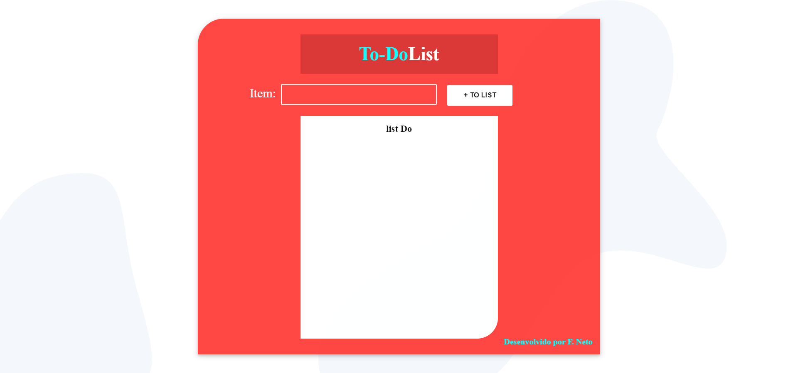

<h1 align="center">To-doList</h1>
<i>Status: em desenvolvimento</i>

## Descrição

Projeto desenvolvido para fins educacionais, afim de consolidar todo o conteudo absorvido durante os estudos com mini-cursos, blogs, publicações, documentações e livros.

## Sobre

Um programa de gerenciamento de tarefas onde você pode adicionar tarefas na lista e de acordo que for finalizando remover.

### Instalação

```
npm install
```

### Compilação

###### Developer

```
npm run serve
```

###### Production

```
npm run build
```

### Recursos

- [x] Adicionar conteudo na lista
- [x] Remover conteudo da lista

### Tecnologias

- Vue.js
- Javascript
- HTML
- Css

### Projeto

<table>
<tr>
<td></td> 
<td></td>
<tr>
</table>

### Contribuição

- Felicio F. M. Neto
